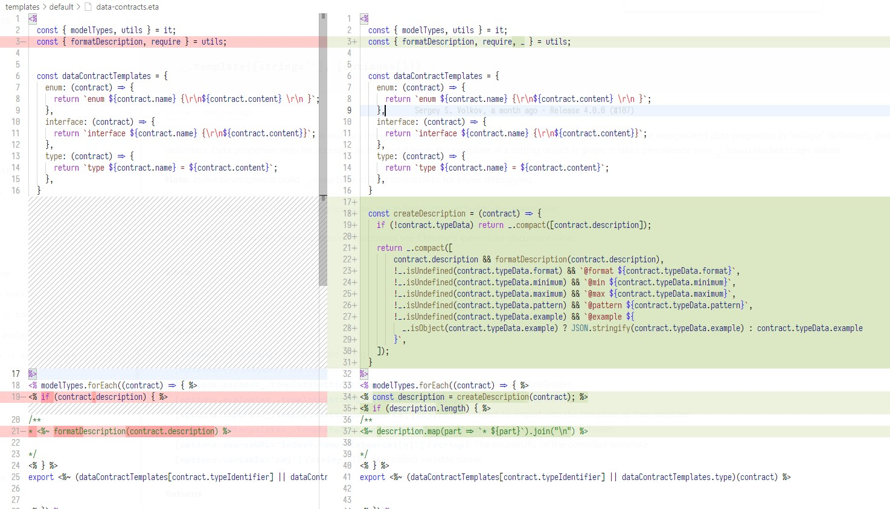

# next release  

BREAKING_CHANGE: change swagger-typescript-api NodeJS "generateApi" function return type  
internal: remove redundant internal scripts  
fix: critical bugs based with extract types and enums  
fix: sort types option (sort was not correctly work with nested or extracted types)  
fix: problems based with extracting enums;
feat: ability to sort routes;
internal: change process with using custom templates  
BREAKING_CHANGE: remove `rawModelTypes` from output api configuration  

```diff
interface GenerateApiOutput {
...
-  files: { name: string; content: string; declaration: { name: string; content: string } | null }[];
+  files: { fileName: string; fileContent: string; fileExtension: string }[];
...
}
```

internal: refactor schema parser code (preparing it for async code execution)  
fix: problem with filtering primitive in complex types (#459)  
feat: add discriminator property support (#456)  
internal: prepare code + templates for async code execution (next plans)  
fix: problems with dot in query params (hard fix) (#460)   
feature: ability to send custom Ts output code translator to js. Example:  
```ts
 const { Translator } = require("swagger-typescript-api/src/translators/translator");
 const { JavascriptTranslator } = require("swagger-typescript-api/src/translators/javascript");

 class MyTranslator extends Translator { // or use extends JavascriptTranslator
     translate({ fileName, fileExtension, fileContent }) {
         // format ts\js code with using this codeFormatter (prettier + ts import fixer)
         this.codeFormatter.format(fileContent)
         // config of the code gen process
         this.config.
         // logger
         this.logger.

         return [
             {
                 fileName,
                 fileExtension,
                 fileContent,
             }
         ]
     }
 }
```

## 12.0.2

fix: missing option `--extract-enums` (#344)  

## 12.0.1  

fix: problem based with http requests and `disableStrictSSL` option (#453)  
docs: update docs for `requestOptions` nodejs option  

## 12.0.0  

new hooks:  
```ts
/** calls before parse\process route path */
onPreBuildRoutePath: (routePath: string) => string | void;
/** calls after parse\process route path */
onBuildRoutePath: (data: BuildRoutePath) => BuildRoutePath | void;
/** calls before insert path param name into string path interpolation */
onInsertPathParam: (paramName: string, index: number, arr: BuildRouteParam[], resultRoute: string) => string | void;
/** calls before parse any kind of schema */
onPreParseSchema: (originalSchema: any, typeName: string, schemaType: string) => any;
```  
BREAKING_CHANGE: add ability to custom prefix for autofix invalid enum keys, invalid type names with nodejs options (`fixInvalidTypeNamePrefix: string`, `fixInvalidEnumKeyPrefix: string`)  
BREAKING_CHANGE: by default all component enum schemas (even numeric) extracting as `enum` TS constructions (#344)   
feature: ability to extract all enums from nested types\interfaces to `enum` TS construction using `--extract-enums` option (#344)   
feature: ability to modify route path params before insert them into string (request url, #446, with using hook `onInsertPathParam`)  
feature: (nodejs) ability to add prefix\suffix for type names and enum keys  
```ts
typePrefix?: string;
typeSuffix?: string;
enumKeyPrefix?: string;
enumKeySuffix?: string;
```
feature: ability to customize resolving process of the extracting type names (`extractingOptions` nodejs option)  
```ts
extractingOptions = {
  // requestBodySuffix: ["Payload", "Body", "Input"],
  // or
  // requestBodyNameResolver: (typeName, reservedNames) => string;

  // requestParamsSuffix: ["Params"],
  // or
  // requestParamsNameResolver: (typeName, reservedNames) => string;

  // responseBodySuffix: ["Data", "Result", "Output"],
  // or
  // responseBodyNameResolver: (typeName, reservedNames) => string;

  // responseErrorSuffix: ["Error", "Fail", "Fails", "ErrorData", "HttpError", "BadResponse"],
  // or
  // responseErrorNameResolver: (typeName, reservedNames) => string;
}
```
docs: update docs for `extraTemplates` option  
fix: problem with default name of single api file (Api.ts)  
fix: problem based with tuple types (#445)  
fix: problem with `defaultResponseType` declaration type  


# 11.1.3  

fix: problems with `text/*` content types (axios, fetch http clients) (thanks @JochenDiekenbrock, #312, #443)  
fix: problem with `application/json*` content type (thanks @JochenDiekenbrock, #440, #441)  
fix: different query type parameters declarations (in route name `{?accountStatus,createdT`, #439)  


# 11.1.2  

fix: problems with missing type imports in `.d.ts` files with using option `--js`    
internal: add extra spec tests  
fix: additionalProperties management problem in Swagger 2 (#343)  
fix: hanging cli after execution finished (#436, thanks @Soarc)  

# 11.1.1  
fix: `--api-class-name` option has no default value (#433)  

# 11.1.0  
BREAKING_CHANGE: replace `axios` to `node-fetch`  
feat: ability to send request options for getting swagger schema by url (`requestOptions` property)  

# 11.0.2  

- fix: problems with --http-client option in `generate-templates` command  
- fix: rewrite file content in `generate-templates` command (`--rewrite` flag)  

# 11.0.0  

## Breaking changes  

 - `data-contract-jsdoc.ejs` file uses new input structure. Please update your local copy.   
 - new codebase (class way)  
 - ability to change everything in codegen process configuration with using NodeJS Api  
 - ability to call `generateApi` function 2 and more times per 1 NodeJS process.  
 - new command `generate-templates` to create source templates  

## [feature] Ability to generate source templates  
New command `generate-templates` which allow you to generate source templates which using with option `--templates`  

## [feature] Ability to modify internal codegen typescript structs     
Everything which creates codegen about output typescript code now contains in `Ts` field in [`src/configuration`](src/configuration.js).
And this thing is available for end user modifications with using NodeJS Cli option `codeGenConstructs`.  
It contains almost all which is not contains in `.eta`\ `.ejs` templates. For example: `Record<string, any>`, `readonly typeField?: value`, etc  

Structure of `Ts` property
```ts
 const Ts = {
    Keyword: {
      Number: "number",
      String: "string",
      Boolean: "boolean",
      Any: "any",
      Void: "void",
      Unknown: "unknown",
      Null: "null",
      Undefined: "undefined",
      Object: "object",
      File: "File",
      Date: "Date",
      Type: "type",
      Enum: "enum",
      Interface: "interface",
      Array: "Array",
      Record: "Record",
      Intersection: "&",
      Union: "|",
    },
    CodeGenKeyword: {
      UtilRequiredKeys: "UtilRequiredKeys",
    },
    /**
     * $A[] or Array<$A>
     */
    ArrayType: (content) => {
      if (this.anotherArrayType) {
        return Ts.TypeWithGeneric(Ts.Keyword.Array, [content]);
      }

      return `${Ts.ExpressionGroup(content)}[]`;
    },
    /**
     * "$A"
     */
    StringValue: (content) => `"${content}"`,
    /**
     * $A
     */
    BooleanValue: (content) => `${content}`,
    /**
     * $A
     */
    NumberValue: (content) => `${content}`,
    /**
     * $A
     */
    NullValue: (content) => content,
    /**
     * $A1 | $A2
     */
    UnionType: (contents) => _.join(_.uniq(contents), ` ${Ts.Keyword.Union} `),
    /**
     * ($A1)
     */
    ExpressionGroup: (content) => (content ? `(${content})` : ""),
    /**
     * $A1 & $A2
     */
    IntersectionType: (contents) => _.join(_.uniq(contents), ` ${Ts.Keyword.Intersection} `),
    /**
     * Record<$A1, $A2>
     */
    RecordType: (key, value) => Ts.TypeWithGeneric(Ts.Keyword.Record, [key, value]),
    /**
     * readonly $key?:$value
     */
    TypeField: ({ readonly, key, optional, value }) =>
      _.compact([readonly && "readonly ", key, optional && "?", ": ", value]).join(""),
    /**
     * [key: $A1]: $A2
     */
    InterfaceDynamicField: (key, value) => `[key: ${key}]: ${value}`,
    /**
     * $A1 = $A2
     */
    EnumField: (key, value) => `${key} = ${value}`,
    /**
     * $A0.key = $A0.value,
     * $A1.key = $A1.value,
     * $AN.key = $AN.value,
     */
    EnumFieldsWrapper: (contents) =>
      _.map(contents, ({ key, value }) => `  ${Ts.EnumField(key, value)}`).join(",\n"),
    /**
     * {\n $A \n}
     */
    ObjectWrapper: (content) => `{\n${content}\n}`,
    /**
     * /** $A *\/
     */
    MultilineComment: (contents, formatFn) =>
      [
        ...(contents.length === 1
          ? [`/** ${contents[0]} */`]
          : ["/**", ...contents.map((content) => ` * ${content}`), " */"]),
      ].map((part) => `${formatFn ? formatFn(part) : part}\n`),
    /**
     * $A1<...$A2.join(,)>
     */
    TypeWithGeneric: (typeName, genericArgs) => {
      return `${typeName}${genericArgs.length ? `<${genericArgs.join(",")}>` : ""}`;
    },
  }
``` 

## [feature] Ability to modify swagger schema type/format to typescript construction translators  
Swagger schema has constructions like `{ "type": "string" | "integer" | etc, "format": "date-time" | "float" | "etc" }` where field `type` is not "readable" for TypeScript.  
And because of this `swagger-typescript-api` has key value group to translate swagger schema fields `type`/`format` to TypeScript constructions.  
See more about [swagger schema type/format data here](https://json-schema.org/understanding-json-schema/reference/string.html#dates-and-times)  
For example, current version of default configuration translates this schema  
```json
{
  "type": "string",
  "format": "date-time"
}
```
translates to  
```ts
string
```
If you need to see `Date` instead of `string` you are able to change it with using `primitiveTypeConstructs`   
```ts
generateApiForTest({
  // ...
  primitiveTypeConstructs: (construct) => ({
    string: {
        'date-time': 'Date'
    }
  })
})
```

Structure of `primitiveTypes` property  
```ts
const primitiveTypes = {
    integer: () => Ts.Keyword.Number,
    number: () => Ts.Keyword.Number,
    boolean: () => Ts.Keyword.Boolean,
    object: () => Ts.Keyword.Object,
    file: () => Ts.Keyword.File,
    string: {
      $default: () => Ts.Keyword.String,

      /** formats */
      binary: () => Ts.Keyword.File,
      file: () => Ts.Keyword.File,
      "date-time": () => Ts.Keyword.String,
      time: () => Ts.Keyword.String,
      date: () => Ts.Keyword.String,
      duration: () => Ts.Keyword.String,
      email: () => Ts.Keyword.String,
      "idn-email": () => Ts.Keyword.String,
      "idn-hostname": () => Ts.Keyword.String,
      ipv4: () => Ts.Keyword.String,
      ipv6: () => Ts.Keyword.String,
      uuid: () => Ts.Keyword.String,
      uri: () => Ts.Keyword.String,
      "uri-reference": () => Ts.Keyword.String,
      "uri-template": () => Ts.Keyword.String,
      "json-pointer": () => Ts.Keyword.String,
      "relative-json-pointer": () => Ts.Keyword.String,
      regex: () => Ts.Keyword.String,
    },
    array: ({ items, ...schemaPart }, parser) => {
      const content = parser.getInlineParseContent(items);
      return parser.safeAddNullToType(schemaPart, Ts.ArrayType(content));
    },
  }
```

## Other  
feat: `--another-array-type` cli option (#414)  
fix: path params with dot style (truck.id) (#413)  


# 10.0.3  
fix: CRLF -> LF (#423)  
docs: add docs for addReadonly nodeJS api flag (#425)  
chore: remove useless trailing whitespaces which make test edit harder (thanks @qboot, #422)  
internal: add test snapshots (git diff + nodejs assertions)  
chore: add logging (project version, node version, npm version)  

# 10.0.2  

fix: host.fileExists is not a function  
fix: other problems linked with new typescript version (4.8.*) (thanks @elkeis, @Jnig)  
fix: problem with required nested properties based on root required properties list  
fix: fetch http client headers content type priority   
fix: fs.rmSync (thanks @smorimoto)
fix: locally overridden security schemes (security flag) (#418, thanks @EdwardSalter)  
docs: add documentation for `unwrapResponseData` nodejs option (thanks @simowe)  
BREAKING_CHANGE: rename `.eta` file extensions to `.ejs`. Backward capability should be existed.  
fix: problem with `--sort-types` option  

# 10.0.*  

fix: problem with default http request headers in axios client  

# 10.0.1  

- fix problem linked with [this.name is not a function](https://github.com/acacode/swagger-typescript-api/issues/381)  
- [internal] add cli tests  
- fix problem with not correct working the `--no-client` option  
- separate data-contracts.ejs onto 4 pieces (enum, interface, type, jsdoc)  

# 10.0.0  

- `--extract-response-body` option - extract response body type to data contract  
- `--extract-response-error` option - extract response error type to data contract   
- `--add-readonly` option - generate readonly properties  
- `authorizationToken` for axios fetch swagger schema request  
- fix: change COMPLEX_NOT_OF to COMPLEX_NOT (internal)
- feat: improve `@deprecated` jsdoc info
- feat: improve `required` field in complex data schemas (anyOf, oneOf, allOf etc)  
- feat: abortSignal for fetch http client
- chore: improve typings in index.d.ts
- fixed [Request falls if FormData attachment is File instance](https://github.com/acacode/swagger-typescript-api/issues/293)
- fixed [Response format - global default or override ?](https://github.com/acacode/swagger-typescript-api/issues/251)

> Co-authored-by: Sergey S. Volkov <js2me@outlook.com>  
> Co-authored-by: Xavier Cassel <57092100+xcassel@users.noreply.github.com>  
> Co-authored-by: cassel <xavier.cassel35@gmail.com>  
> Co-authored-by: Adrian Wieprzkowicz <Argeento@users.noreply.github.com>  
> Co-authored-by: EvgenBabenko <evgen.babenko@gmail.com>  
> Co-authored-by: RoCat <catoio.romain@gmail.com>  
> Co-authored-by: rcatoio <rcatoio@doubletrade.com>  
> Co-authored-by: 卡色 <cipchk@qq.com>  
> Co-authored-by: 江麻妞 <50100681+jiangmaniu@users.noreply.github.com>  
> Co-authored-by: Kasper Moskwiak <kasper.moskwiak@gmail.com>  
> Co-authored-by: Ben Watkins <ben@outdatedversion.com>  
> Co-authored-by: bonukai <bonukai@protonmail.com>  
> Co-authored-by: baggoedw <92381702+baggoedw@users.noreply.github.com>  
> Co-authored-by: Marcus Dunn <51931484+MarcusDunn@users.noreply.github.com>  
> Co-authored-by: Daniele De Matteo <daniele@kuama.net>  
> Co-authored-by: Daniel Playfair Cal <daniel.playfair.cal@gmail.com>  
> Co-authored-by: Anders Cassidy <anders.cassidy@dailypay.com>  
> Co-authored-by: Daniel Playfair Cal <dcal@atlassian.com>  

# 9.2.0  

Features:  
- full response typing for status code, data and headers. (#272, thanks @rustyconover)  
- --unwrap-response-data to unwrap the data item from the response (#268, thanks @laktak)  

Fixes:  
- fix: formdata in axios template (#277, thanks @tiagoskaneta)  

# 9.1.2

Fixes:  
- Bug with --single-http-client and private `http` property  

# 9.1.1  

Fixes:  
- Bug with nested objects in FormData (issue #262, thanks @avlnche64)  

# 9.1.0  

Fixes:  
- Critical bug linked with `templateRequire` in ETA templates  
- Critical bugs linked with `--type-prefix`, `--type-suffix`  

Internal:  
- Improve manual testing scripts  

# 9.0.2  

Fixes:  
- 9.0.1 won't build with tsc when imported (thanks @mastermatt)  

# 9.0.1  

Fixes:  
- Can't compile 9.0.0 version (thanks @Nihisil )  

# 9.0.0  

NOTE: This version is not compatible with previous templates (removed `route.request.params`, `apiConfig.props`, `apiConfig.generic`, `apiConfig.description`, `apiConfig.hasDescription`)  

Fixes:  
- Consider 2xx a successful status (thanks @wyozi)  
- GET method query option bug (thanks @rhkdgns95, @SaschaGalley)  
- `silent` property missed in `.d.ts` file (thanks @mastermatt)  
- axios file upload `formData` type (thanks @guhyeon)  
- make property `instance` to public in axios http client (It can be helpful in #226)  
- variable name "params" doesn't uniq (thanks @mixalbl4-127 )  

Features:  
- `--disableProxy` option (thanks @kel666)  
- `--extract-request-body` option. Allows to extract request body type to data contract  
- Add TSDoc tag for deprecated route (thanks @wyozi)  


# 8.0.3  

- Fixes encoding array query params in `fetch` http templates (thanks @prog13)  

# 8.0.2  

Fixes:  
- Wrong working the `format` option in `fetch` http client  

# 8.0.1  

Fixes:  
- Not working `customFetch` 
  Error: `Failed to execute 'fetch' on 'Window': Illegal invocation`   

# 8.0.0  

BREAKING_CHANGES:  
- remove default `json` format of the response type (both for `axios` and `fetch` http clients) (issue #213, thanks @po5i)  

Features:  
- Allow passing custom fetch function (`fetch` http client only)  
- Allow to set global response type format through `HttpClient` constructor  
  Example:  
```ts
    const httpClient = new HttpClient({ format: 'json' });
    // all request responses will been formatted as json  
```
Fixes:  
- Missing `schema.$ref` in inline enum schemas  
- Array query param values are serialized with the (non-default) comma separated style (issue #222, thanks @Styn, PR #223)  
- TypeScript error "TS6133: 'E' is declared but its value is never read." (`axios` http client) (issue #220, thanks @pmbednarczyk )  

# 7.0.1  

Fixes:  
- "securityWorker" is only used if "secure" option is specified on each request (issue #212, thanks @dkamyshov)  
  NOTE: added global `secure` option for `axios` http client  
- `index.d.ts` file (add `rawModelTypes`)  

# 7.0.0  

BREAKING_CHANGES:  
- format `namespace` name in `--route-types` as camelCase with upper first capitalized letter  
  `foo_bar` -> `FooBar`  

Fixes:  
- Incorrect working the `--route-types` option with `--modular` option (route types should be splitted on files)  
- Fix critical bug linked with enums with boolean type (thanks @haedaal)  

Features:  
- Ability to return `false` in `onCreateRoute` hook, it allow to ignore route  
- Add output util functions  
```ts
  createFile: (params: {
    path: string;
    fileName: string;
    content: string;
    withPrefix?: boolean;
  }) => void;
  renderTemplate: (
    templateContent: string,
    data: Record<string, unknown>,
    etaOptions?: import("eta/dist/types/config").PartialConfig
  ) => string;
  getTemplate: (params: {
    fileName?: string;
    name?: string;
    path?: string;
  }) => string
  formatTSContent: (content: string) => string;


  // ...

  generateApi({ /* ... */ }).then(({ createFile, renderTemplate, getTemplate }) => {
    // do something
  })
```

# 6.4.2  

Fixes:  
- Bug with missing `name` property in in-path requests parameters  
- Problem with usage `--route-types` with `--modular` option (mising import data contracts)  

# 6.4.1  

Fixes:  
- Bug with axios headers (thanks @mutoe)  

# 6.4.0  

Features:  
- `onFormatRouteName(routeInfo: RawRouteInfo, templateRouteName: string)` hook. Allows to format route name, as you like :)  

Fixes:
- Bug with wrong complex types (anyOf, oneOf, allOf) when some child schema contains only description  
    
- Bug with number enums which have `x-enumNames`  
- Problem with not existing `title` property in `info`  

Minor:  
- Improve description for complex types  
- Improve description in single api file  

# 6.3.0  

Features:  
- `--type-suffix` option. Allows to set suffix for data contract name. (issue #191, thanks @the-ult)  
- `--type-prefix` option. Allows to set prefix for data contract name. (issue #191, thanks @the-ult)  
  Examples [here](./spec/typeSuffixPrefix/schema.ts)  
- `onFormatTypeName(usageTypeName, rawTypeName, schemaType)` hook. Allow to format data contract names as you want.  

Internal:  
- rename and split `checkAndRenameModelName` -> `formatModelName`, `fixModelName`  

# 6.2.1  

Fixes:  
- missing `generateUnionEnums?: boolean;` in `index.d.ts` file (thanks @artsaban)  
- missing default params to axios http client (`--axios`) (issue #192, thanks @Nihisil)  

# 6.2.0  

Features:  
- `--module-name-first-tag` option. Splits routes based on the first tag (thanks @jnpoyser)  

# 6.1.2  

Fixes:  
- Problems with using both `--axios` and `--modular` options together (TS, `organizeImports` crashed the codegeneration)  

# 6.1.1  

Fixes:  
- Problems with `--axios` option  
  - ignoring `path`, `format`, `type` payload properties in `request()` method of `HttpClient`  
- Missing `format` property for requests in `--modular` option  

# 6.1.0  

Features:  
- `--silent` option. Output only errors to console (default: false)  

Fixes:  
- Bug with `kebab-case` path params (issue #184, thanks @Mr-sgreen)  
- Typings for `--js` option  

# 6.0.0  

BREAKING_CHANGES:  
- Ability to override only one template (issue #166, thanks @Nihisil)  
- removed `TPromise` type for `--responses` options (perf. problem, issue #182, thanks @mixalbl4-127)  
- breaking changes in `http-client.eta`  
- `securityWorker` now can return `Promise<RequestParams | void> | RequestParams | void`  

Features:  
- template path prefixes `@base`, `@default`, `@modular` (using in Eta templates, `includeFile()`, see README.md)  
- `--axios` option for axios http client (issue #142, thanks @msklvsk, @mixalbl4-127 )  

# 5.1.7  

Fixes:  
- Do not fail if template file does not exist (issue #166, thanks @armsnyder )  
  Caveat: With this fix it will still error if the overridden template uses `includeFile` on a template file that is not overridden  

# 5.1.6  

Fixes:  
- The contentFormatter for ContentType:Json does not correctly format strings (issue #176, thanks @Styn)  

# 5.1.5  

Fixes:  
- ContentType.FormData no longer sets the correct boundary (issue #172, thanks @Styn)  

# 5.1.4  

Fixes:  
- header overwrite in `default` and `modular` API templates (issue #171 by @Styn, thanks @emilecantin for PR with fix)  

# 5.1.3  

Fixes:  
- Ignored `x-nullable` field  
- Schema type names which starts with number or special characters  

# 5.1.2  

Fixes:  
- Linter disable rules is not working (issue #164, thanks @Haritaso)  

# 5.1.1  

Fixes:  
- The HttpResponse type is no longer exported from http-client (issue #161, thanks @Styn)  

# 5.1.0  

Fixes:  
- Bug with optional nested properties of object schema type (issue #156, thanks @Fabiencdp)  

Features:   
- `onCreateRouteName(routeNameInfo: RouteNameInfo, rawRouteInfo: RawRouteInfo): RouteNameInfo | void` hook  
  Which allows to customize route name without customizing `route-name.eta` template  
- Improved content kinds for request infos  
- `--single-http-client` option which allows to send HttpClient instance to Api constructor and not to create many count of HttpClient instances with `--modular` api (issue #155)   

Minor:  
- A bit improve type declaration file (index.d.ts) for this tool  
- make exportable `ApiConfig` interface  

Internal:  
- clearing `routeNameDuplicatesMap` before each `parseRoutes()` function call  
- Changed templates:  
  - `http-client.eta`  
  - `procedure-call.eta`  
  - `api.eta`  

# 5.0.0  

Fixes:  
- Request content types auto substitution  
  i.e. if request body is form data, then request body content type will be `multipart/form-data`  
- Strange method name (issue #152, thanks @RoXuS)  
- Hardcoded Content-Type causes issues with some endpoints (issue #153, thanks @po5i)  
- Critical bug with `:paramName` path params (issue #154)  

Features:  
- Ability to provide custom formatting `fetch` response  
- `"IMAGE"` content kind for response\request data objects  
- `RequestParams` `RequestHeaders` types for `--route-types` (`routeTypes: true`) option (issue #150, thanks @Fabiencdp )  
- `--default-response` option. Allows to set default type for empty response schema (default: `void`) (based on issue #14)  
- Request cancellation support (issue #96, thanks @ApacheEx)  
  `RequestParams` type now have the `cancelToken` field  
  `HttpClient` instance now have the `abortRequest(cancelToken)` method  

BREAKING_CHANGES:  
- Fully refactored `http-client.eta` template, make it more flexible and simpler.  
  `HttpClient["request"]` takes one argument with type `FullRequestParams`  
  (previously it takes many count of arguments which was not flexible)  
- Changed the default response body type from `any` to `void` (issue #14)   

Internal:  
- Changed templates:  
  - `http-client.eta`  
  - `procedure-call.eta`  
  - `api.eta`  

This version works with previous templates.  

# 4.4.0  

Fixes:  
- Client generation for `Content-Type: application/x-www-form-urlencoded` (issue #146, thanks @Larox)  

Internal:  
- Changed templates:  
  - `http-client.eta`  
  - `procedure-call.eta`  

# 4.3.0  

Fixes:  
- enum + nullable: true doesn't compute the good type (issue #145, thanks @RoXuS)  
- Underscores are omitted from enum keys (issue #108, thanks @eolant)  
- CLI silently fails if the directory to put new files in doesn't exist yet (issue #141, thanks @Styn)  

Features:  
- Improved type description   

Internal:   
- dependencies update:  
  - `"js-yaml": "^4.0.0"` (`"^3.14.1"`)  
  - `"make-dir": "^3.1.0"`
  - `"swagger2openapi": "^7.0.5"` (`"^7.0.4"`)  
- Difference in templates:  
  - `data-contracts.eta`  
    

# 4.2.0  
Features:  
- new hook `onCreateRequestParams` which allows modify request params (`--extract-request-params` option) before sending it to route info   
    
  How to use:  
  ```ts
    generateApi({
      // ... your config,
      hooks: {
        onCreateRequestParams: (rawType) => {
          if (Object.keys(rawType.properties).length > 1) return rawType;

          return rawType;
        }
      }
    })
  ```   
- response content types (array of string like `application/json`, `image/png`) which allows to customize declaration of request response  
  Exist in `procedure-call.eta` template `it.route.response.contentTypes`  

Internal:  
- Difference in templates:  
  - `procedure-call.eta`  
    


# 4.1.0  

Features:  
- Improve `require()` function used in ETA templates (using relative path imports)  
- `--clean-output` option.  
  clean output folder before generate api  

Fixes:  
- Error: `Unexpected token =` (Issue #136, Thanks @jlow-mudbath)  
- Output folder creation (Issue #137, Thanks @Rinta01)  
  Create output folder if it is not exist  

# 4.0.5  

BREAKING_CHANGE:  
- remove `'prettier-plugin-organize-imports'` dependency from package  

Fixes:  
- issue #134 (Thanks @mrfratello)  

# 4.0.4  

Features:  
- add `require()` to template `utils` object  

Docs:  
- add information about contributors  

# 4.0.3  

Features:  
- `--disableStrictSSL` option for disable strict SSL statement with fetching swagger schema. (Thanks @kel666 for PR with feature request)  
  This option fix problem #114  

# 4.0.2  

Fixes:  
 - `Unexpected token '.'` on v4 (Thanks @savingprivatebryan for issue #111)  
    Replaced all new syntax sugar like `?.` or `??` to prev. alternatives for support nodejs 12  

# 4.0.1  

Fixes:  
- `Cannot find module 'prettier-plugin-organize-imports'` #109  

# 4.0.0  

BREAKING_CHANGES:  
- Migrate from [mustache](https://mustache.github.io/) template engine to [ETA](https://eta.js.org/) template engine. (Thanks @Fl0pZz)  
- Critical change in `HttpResponse` type (Remove `D | null`, `E | null` unions)  
```diff
interface HttpResponse<D extends unknown, E extends unknown = unknown> extends Response {
-  data: D | null;
+  data: D;
-  error: E | null;
+  error: E;
}
```

Features:  
- `--modular` option. Allows to generate api class per module name.   
  Example: [here](./tests/spec/modular)   
- new templates on [ETA](https://eta.js.org/) (enhanced EJS) which can improve your templates! (Thanks @Fl0pZz)   
  [ETA extension for Visual Studio Code](https://marketplace.visualstudio.com/items?itemName=shadowtime2000.eta-vscode) (thanks @shadowtime2000)  
  Also moved out to templates:
    - `procedure-call.eta` (request api method template)  
    - `route-name.eta` (api method name template)  
    - `route-docs.eta` (api method docs template)  

  No worry about strange syntax it is very simple in usage :)  
- Optional templates feature (Except templates using in `includeFile` `ETA` directive)  
  Now you can store only the `ETA` templates which you need to change for yourself.  
- `--extract-request-params` option. Generate path and query request params data contract and modify request payload args   
  Example:  
    
- Improve `data-contracts.eta` template. Added more power :)  
- Add `extraTemplates` property for `generateApi()`. Allows to generate extra files via this tool.  
- Add `hooks` property for `generateApi()`  
  ```ts
  hooks?: Partial<{
    onCreateComponent: (component: SchemaComponent) => SchemaComponent | void;
    onParseSchema: (originalSchema: any, parsedSchema: any) => any | void;
    onCreateRoute: (routeData: ParsedRoute) => ParsedRoute | void;
    /** Start point of work this tool (after fetching schema) */
    onInit?: <C extends GenerateApiConfiguration["config"]>(configuration: C) => C | void;
    /** Allows to customize configuration object before sending it to templates. */
    onPrepareConfig?: <C extends GenerateApiConfiguration>(currentConfiguration: C) => C | void;
  }>;
  ```
  ```ts
    generateApi({
      input: "./schema.json",
      output: "./__generated__",
      hooks: {
        onCreateComponent(component) {
          // do something
          return component;
        },
        // ...
      }
    })
  ```

Internal:  
- Update all dependencies to latest  

Fixes:  
- `x-enumNames` support for enums  
- Problem of complex types (`oneOf`, `allOf`) with `properties` field  
- `additionalProperties: true` should make `[key: string]: any` for object types (Thanks @brookjordan for issue #103)  

Common:  
- `HttpClient` is exportable by default  
- Improve typings when use `swagger-typescript-api` with NodeJS (`index.d.ts`)  

# 3.1.2  
Fixes:  
- axios vulnerability (#101 issue, thanks @Mvbraathen)  

# 3.1.1  

Fixes:  
- `name.includes is not a function` (issue #98)  

# 3.1.0  

Features:  
- `--moduleNameIndex` option. determines which path index should be used for routes separation (Thanks @nikalun)  
  Examples:  
    GET:api/v1/fruites/getFruit -> index:2 -> moduleName -> fruites
    GET:api/v1/fruites/getFruit -> index:0 -> moduleName -> api

# 3.0.1  

Fixes:  
- invalid default templates path (#92, thanks @larrybotha for quick fix)  

# 3.0.0  

BREAKING_CHANGES:  
- Renamed mustache templates:  
  - `api.mustache` -> `data-contracts.mustache`   
  - `client.mustache` -> `http.client.mustache` + `api.mustache`  
- Split the `client.mustache` template into two parts: `http-client.mustache` and `api.mustache`  

Fixes:  
- Fixed unsafe clone() of Response causing json() hang. (Thanks @Benjamin-Dobell)  

# 2.0.0  

Features:
- `--js` CLI option. [[feature request]](https://github.com/acacode/swagger-typescript-api/issues/79)  

BREAKING_CHANGES:  
- Requests returns `Promise<HttpResponse<Data, Error>>` type.  
  `HttpResponse` it is [Fetch.Response](https://developer.mozilla.org/en-US/docs/Web/API/Response) wrapper with fields `data` and `error`
  Example:  
  ```ts
    const api = new Api()
    
    //
    const response: HttpResponse<Data, Error> = await api.fruits.getAll()

    response.data // Data (can be null if response.ok is false)
    response.error // Error (can be null if response.ok is true)
  ```  
- Breaking changes in the `client.mustache` template. Needs to update local custom templates.  

Fixes:  
- Security configuration in methods. When the security definition is in the main configuration of the swagger definition  


# 1.12.0   

Features:  
- Can provide ability to generate from swagger JSON directly not from a file? #69 (Thanks @JennieJi)  

Fixes:  
- handling `x-omitempty` property for definition properties #68  
- Additional properties map to empty interfaces (OpenAPI v3) #76  
- Pattern fields in Path Item Object are treated as operations #75  
- Remove const enum from default template #73  
- enums with spaces throw an error #71  


# 1.11.0  

Features:  
- Improve the naming of model types ([#65 issue](https://github.com/acacode/swagger-typescript-api/issues/65))  

# 1.10.0  

Features:  
- `--templates` CLI option. [[feature request]](https://github.com/acacode/swagger-typescript-api/issues/54)  
  Provide custom `mustache` templates folder which allows to generate custom code (models, Api class, routes)  
- `--union-enums` CLI option. [[feature request]](https://github.com/acacode/swagger-typescript-api/issues/58)  
  Allows to generate all enums as union types.  
  For example, schema part:  
  ```
  "StringEnum": {
    "enum": ["String1", "String2", "String3", "String4"],
    "type": "string"
  }
  ```  
  will be converted into:
      ```
export type StringEnum = "String1" | "String2" | "String3" | "String4";
      ```  
  

# 1.8.4  

Fixes:  
- Multiple types for a property in Swagger 2 are not handled correctly ([#55 issue](https://github.com/acacode/swagger-typescript-api/issues/55)) 

# 1.8.3  

Fixes:  
- Generating invalid code in composed schema contexts ([#51 issue](https://github.com/acacode/swagger-typescript-api/issues/51)) 
  ```yaml
  components:
  schemas:
    Test:
      type: object
      allOf:
        - type: object
          properties:
            x:
              type: array
              items:
                type: string
                enum:
                  - A-B
        - type: object
          properties:
            y:
              type: string
  ```
  ```ts
  export type Test = XAB & { y?: string };
  ```

# 1.8.2  

Fixes:  
- Broken types for arrays of union types ([issue](https://github.com/acacode/swagger-typescript-api/issues/49))  

# 1.8.1  

Fixes:  
- form data request body (request body content `multipart/form-data`)  

Minor:  
- inline comments of the data contract type properties  
    
- remove `Array<T>` type usage (now the more simple type `T[]`)

# 1.8.0    

Features:  

- **Partially** support FormData body types  
- Support to generate query params of nested query objects (Partial fix of [this issue](https://github.com/acacode/swagger-typescript-api/issues/45))  


# 1.7.2  

Fixes:  

- Critical bug with converting inline object into name of type for request body.  
- Fix bug when path parameters is not set but contains in endpoint url.  
    
    


# 1.7.0  

Breaking Changes:  

- Remove `title` and `version` public Api class properties (moved it to Api class JSDOC)([fixes this issue](https://github.com/acacode/swagger-typescript-api/issues/41))  
    
- Move out all http client handlers/properties into `HttpClient` local class in module  
    
    

Chore:  

- default value for `SecurityDataType` Api class generic type  
  

# 1.6.3  

Fixes:  

- Handling of nullable for $ref in OpenAPI 3.0 ([issue](https://github.com/acacode/swagger-typescript-api/issues/39))  
  Plus based on this issue was fixed most other problems with using `required` and `nullable` properties  


# 1.6.2  

Fixes:  

- Nullable not included in type definition ([issue](https://github.com/acacode/swagger-typescript-api/issues/36))  

Internal:

- Update `swagger2openapi`(`6.0.0`) dependency    

# 1.6.1  

Internal:

- Update `prettier`(`2.0.2`), `swagger2openapi`(`5.4.0`) dependencies  

# 1.6.0

Features:

- Improvenment in optional request params (request body, query params, path params)

Fixes:

- Fix bug when `path` request param have the same name as `query`
- Fix bug when `path` request param have the same name as `params`

Minor/Internal:

- changed `addQueryParams()` method
- up `swagger2openapi` dependency version to `5.3.4`

# 1.5.0

Features:

- Add `prettier` for beautify output typescript api module
- Support `additionalProperties` type data  
  

Fixes:

- Fix problem with array `type` definitions without `type` property([#26](https://github.com/acacode/swagger-typescript-api/issues/26))

# 1.4.1

Fixes:

- Fix TS problem with `addQueryParams` Api class method (issue [#22](https://github.com/acacode/swagger-typescript-api/issues/22), thanks [genaby](https://github.com/genaby))

# 1.4.0

Breaking Changes:

- Rename default typescript output api file name (prev `api.ts`, now `Api.ts`)  
  Features:
- `-d, --default-as-success` option. Allows to use "default" status codes as success response type
- `-r, --responses` option. Response declarations in request rescription  
  This option adds comments of the possible responses from request   
    
  Also typings for `.catch()` callback  
  
- Improve response body type definitions
- Types for bad responses  
  Changes:
- \[minor\] fix jsdoc comments space  
  

# 1.3.0

Features:

- Api module description from schema info  
  
- Generate API type declarations (CLI flag `--route-types`, thanks [azz](https://github.com/azz))  
  
- Ability to not generate clint API class (CLI flag `--no-client`, thanks [azz](https://github.com/azz))

Fixes:

- Improve response body type definition

Internal:

- refactored `generate` and `validate` test scripts

# 1.2.6

Fixes: create api without `-o` option (use default `./` output)

# 1.2.5

Features: better naming of routes without `operationId`  
  
Changes: rename `@security true` -> `@secure`, `@duplicate true` -> `@duplicate`  
Fixes: Support generated swagger schemes from tsoa 3.x with complex types (Omit, Pick, etc)

# 1.2.4

Features: add .d.ts file into npm package  
Changes: update help block in CLI  
Internal: add greenkeeper, update npm keywords

# 1.2.3

Features: @summary, @description comments at each route  
Fixes: parsing schema without routes  
Changes: update documentation  
Internal: add anyOf, allOf test schemas, slack notifications in CI

# 1.2.2

Fixes: fix complex types (oneOf, anyOf), required fields of object type was not required

# 1.2.0

Changes: rename `ApiParams` to `RequestParams`, secure module always exist in generated API module, update documentation  
Fixes: Query params was all required, parse yaml files, typescript minor warnings (;)  
Internal: test schemas + manual testing, add travis CI/CD

# 1.1.0

Fixes: catching http errors with use API module

# 1.0.9

Features: add description to interfaces and their fields  
Changes: update documentation

# 1.0.8

Changes: update documentation

# 1.0.7

Changes: update documentation (+ add logo), add comment about author in generated module

# 1.0.6

Fixes: route naming, http(s) requests for getting swagger schema, integer enums  
Changes: include only required files into npm pacakge

# 1.0.5

Changes: update documentation

# 1.0.4

Changes: disable linters rules for generated API module  
Fixes: TS issues in template

# 1.0.3

Fixes: NodeJS main script cannot been called on Unix\* machines  
Changes: add LICENSE, update README

# 1.0.2

Changes(Internal): change dependencies

# 1.0.1

New features: query params, separating routes on submodules, common params in constructor, swagger v2 + yaml parsers  
Enhancements: better type extracting.  
Fixes: mustache escaping chars  
Changes: order of request params, emojis messages in console

# 1.0.0

Initial project.
